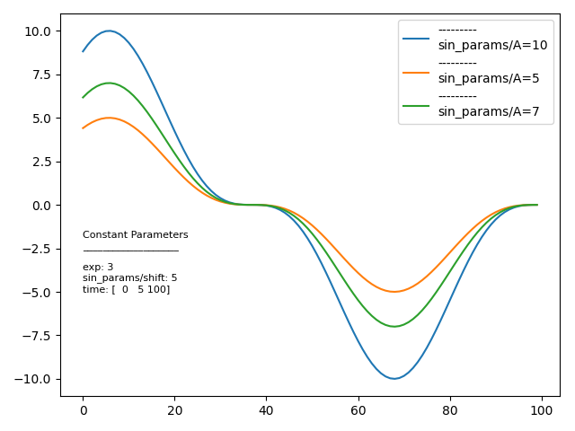

***********
ABR Analyze
***********

ABR_Analyze: A repository with helper functions wrapping the hdf5 package. Allows for simplified saving, loading, and searching of data.

Installation
============
To install abr_analyze simply run::

    pip install -e .

Features that visualize robotic arms require an install of abr_control::

    git clone https://github.com/abr/abr_control.git

    cd abr_control

    pip install -e .

Setting paths
=============
HFF5 databases can be thought of as a compressed file (.h5) that saves dictionaries. Keys, including keys for nested dictionaries, are treated as folders with the corresponding values being the data entries.

By default, abr_analyze will create a ``data/databases`` folder from the run directory to store databases. This directory can alternatively be set on instantation of a ``DataHandler`` with the ``<database_dir>`` parameter.

To set the default value to avoid passing a folder in on init, update ``abr_analyze/paths.txt`` to have the full path to your save directory following the ``<database_dir:>`` entry.

Manually saving and loading
=====
1. Instantiate a database::

    from abr_analyze import DataHandler

    database = DataHandler('database_name')

2. Save Results::

    my_results = {'key1': 3, 'key2': [3, 4, 5], 'nested_dict': {'a': 3, 'b': 6}}
    database.save(
        save_location='experiment1',
        data=my_results
    }

3. Load Data::

    subset_loaded_data = database.load('experiment1', parameters=['nested_dict'])
    # or load all keys
    all_loaded_data = database.load('experiment1')

Automated Saving with data_logger
=====
Alternatively, abr_analyze can automatically save and link results to the parameters that generated them, provided a dictionary of parameters, a dictionary of results, and a unique name for the script that generated the results with the data_logger.searchable_save() function::

    from abr_analyze import data_logger

    # Instantiate database to save results
    db_name = "searchable_results_example"
    dat = DataHandler(db_name=db_name)

    # generate baseline json
    params = {
        "sin_params": {
            "A": 3,
            "shift": 5,
        },
        "time": [0, 5, 100],
        "exp": 2,
    }

    # if loading from json
    # with open(json_fp) as fp:
    #     params = json.load(fp)

    # example function that generates results
    # Needs to accept params dict as input and return dictionary of results
    def example_results(params):
        t = np.linspace(params["time"][0], params["time"][1], params["time"][2])
        y = (
            params["sin_params"]["A"]
            * np.sin(t - params["sin_params"]["shift"]) ** params["exp"]
        )
        return {"t": t, "y": y}

    # unique name for script that generates results
    # should update name if something changes in the script that would affect results
    script_name = "example_script"

    # get results
    print("--Getting results for baseline parameters--")
    results = example_results(params)

    # save in searchable format
    print("--Saving baseline results--")
    data_logger.searchable_save(dat=dat, results=results, params=params, script_name=script_name)

Running Parameter Variations
=====
The data_logger also has a helper function for quickly generating permutations of a parameter set. These can be saved in the same searchable manner to allow for a quick comparison of results::

    # helper function to quickly create some variations of our parameter set
    print("--Generating parameter variations--")
    param_variations = data_logger.gen_parameter_variations(
        params=params, variation_dict={"sin_params/A": [5, 7, 10], "exp": [3, 4]}
    )

    # get results for each variation and save
    print("--Getting results for parameter variations--")
    for hash_id, varied_params in param_variations.items():
        print(f"\nGetting results for {hash_id}")
        # pretty printing of nested dictionaries
        data_logger.print_nested(varied_params, indent=0, return_val=False)

        results = example_results(varied_params)
        print("Saving results")
        data_logger.searchable_save(
            dat=dat, results=results, params=varied_params, script_name=script_name
        )

Searching and Plotting Results
=====
Once some results and their corresponding parameter sets have been saved using data_logger.searchable_save(), the results can be searched for experiments that match a subset of parameters::

    # now load all results that have these parameter values
    const_params = {
        "exp": 3,
    }
    # result keys to load
    result_keys = ["y"]

    # Load results that have a set of common parameters
    print(f"Loading results with parameters:\n{const_params}")
    results = data_logger.load_results(
        script_name=script_name,
        const_params=const_params,
        saved_exp_hashes=None,
        result_keys=result_keys,
        dat=dat,
        ignore_keys=None,
    )

    # plot the results
    plt.figure()
    ax = plt.subplot(111)
    for hash_name in results:
        # ignore const and variable params keys
        if "params" in hash_name:
            continue
        # print(dict_nested2str(results[hash_name]))
        ax.plot(results[hash_name]["results"]["y"], label=results[hash_name]["name"])

    # print the values that are constant between all tests
    ax.text(
        0,
        -5,
        (
            "Constant Parameters\n"
            + "___________________\n"
            + data_logger.dict_nested2str(results["const_params"])
        ),
        fontsize=8,
    )
    plt.subplots_adjust(right=0.6)

    plt.legend()
    plt.tight_layout()
    plt.show()

See the examples folder for examples covering the full range of functionality of the repository, including: plotting grids of figures, coverting figures to gifs, replaying arm trajectories in 3d plot gifs, and many more.
